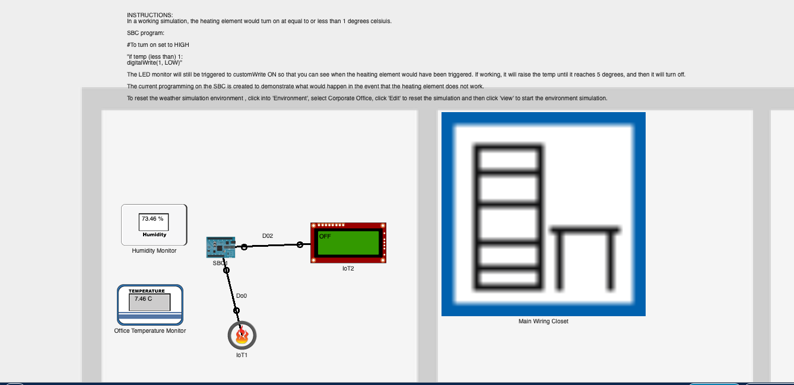

### Title:
Happy Pipes


### Description:

Happy Pipes is an end-to-end IoT monitoring system designed to simulate and manage environmental conditions affecting outdoor plumbing systems, such as exposed pipes at risk of freezing or condensation. The project combines simulated sensors, physical hardware, networking protocols, cloud services, and user-facing dashboards to demonstrate a realistic IoT architecture.

A Cisco Packet Tracer simulation models environmental temperature sensors and a heating device relevant to outdoor pipe protection. Sensor telemetry is transmitted via UDP to a Raspberry Pi acting as an edge device. The Pi processes incoming data, calculates derived metrics such as dew point, and coordinates system behaviour based on environmental risk conditions.

Sensor data is distributed using MQTT to multiple consumers, including a web dashboard and the Blynk mobile application. The system supports real-time monitoring, historical data analysis, automated alerts, and image capture. A Flask-based web interface is deployed on Render, providing public access to live readings, historical charts, and captured images. Cloud services are used for image and chart storage, while mobile notifications ensure users are alerted to conditions that may impact outdoor plumbing. The project demonstrates how simulated environments can be effectively integrated with physical devices and cloud platforms.

### Usage:



- Link to Packet Tracer Simulation File: [(PKT)](packet_tracer/simulate_temp.pkt)

A simulated IoT environment was created in Cisco Packet Tracer to model temperature sensors and a heating device. Sensor telemetry is sent via UDP to a Raspberry Pi listener service, bridging simulated devices with physical hardware. This data is then published via MQTT to a web dashboard, which displays live environmental readings, up-to-date historical graphs, and urgent environmental conditions.

The same MQTT data is also sent to the Blynk mobile application for real-time monitoring. If the heating system fails to activate when the temperature drops to ≤ 1 °C, the Raspberry Pi camera captures an image and a low-temperature alert is triggered. A dew point alert is also generated when the dew point falls to ≤ 13 °C. In both cases, increasing the heating resolves the alert condition. The user is notified directly on their phone and receives an email prompting them to view the Blynk app or the Happy Pipes web dashboard to review current conditions and urgent images.

### Examples:

#### Allow Raspberry Pi to Connect with Cisco Simulated Environment via UDP:

Packet Tracer simulated sensors communicate with the Raspberry Pi using UDP. A UDP listener runs on the Pi and receives sensor data packets in real time. The packets are parsed, processed, and published using MQTT i.e full integration with the IOT system, web API and dashboards.


- The Raspberry Pi opens a UDP socket on port 5000

- Packet Tracer simulated sensors send UDP packets to this port

- Incoming sensor data is decoded and passed to the application for processing

#### sensor_listener.py

```py
   def stop(self):
        #Stop the UDP listener.
        self.running = False

    def _listen(self):
        #Internal method to listen for UDP packets and handle them.
        with socket.socket(socket.AF_INET, socket.SOCK_DGRAM) as server:
            server.bind((self.host, self.port))
            print(f"UDP Listener started on {self.host}:{self.port}")
            while self.running:
                try:
                    data, address = server.recvfrom(self.buffer_size)
                    print(f"Received data: {data.decode()} from {address}")
                    if self.callback:
                        self.callback(data.decode())
                except Exception as e:
                    print(f"Error receiving data: {e}")
            print("UDP Listener stopped.")
```

- Parsed sensor data is published as MQTT via MQTT Broker.

- MQTT acts as the brige or gateway between: Packet Tracer (UDP), Flask API, Blynk dashboard & Cloud services


#### listener_service.py


```py
 # Publish to MQTT 
        client.publish(MQTT_TOPIC_UDP, json.dumps(env_state))
        print("MQTT published:", env_state)
```

#### MQTT subscription - real time data handling

The Pi subscribes to environmental data via MQTT by listening to the /orla/env/udp topic on a public broker.It receives real-time JSON payloads containing temperature, humidity, and dew point data, decodes them, and stores them in memory. The Pi can react immediately to new sensor readings — triggering LEDs, alerts, and image capture without polling.


#### blynk.py

```py 

def on_connect(client, userdata, flags, rc):
    print("MQTT connected with result code", rc)
    client.subscribe(MQTT_TOPIC_UDP)
    print("Subscribed to:", MQTT_TOPIC_UDP)


def on_message(client, userdata, msg):
    print("MQTT message on", msg.topic)
    global new_env
    payload_str = msg.payload.decode("utf-8")
    data = json.loads(payload_str)  
    # data["ts"] = int(time.time())

    new_env=data #store MQTT data in global var - 


```

### HTTP integration with Blynk

After capturing an image and uploading it to Cloudinary, the Pi sends the public image URL to Blynk using a HTTP request. The image is then displayed directly in the mobile app. This allows for MQTT-based data communication with HTTP communication.

#### blynk.py

```py
# Send image URL to Blynk virtual pin V2
        response = requests.get(
            "https://blynk.cloud/external/api/update/property",
            params={
                "token": BLYNK_AUTH,
                "pin": "V2",
                "urls": image_url_cloud
            }
        )
        print(f"Status: {response.status_code}, response: {response.text}")

        if response.status_code == 200:
             image_sent = True
        else:
            print(f"Failed to send image. Will retry later")
            sleep(10)
            image_sent = False

    except requests.RequestException as e:
        print(f"Exception sending image: {e}")
        image_sent = False

```

### Cloud-Based Image and Chart Storage (Cloudinary Integration)

Camera images and the generated chart image are uploaded from the Pi to Cloudinary secure HTTPS. Each upload overwrites the previous image, ensuring the latest image and chart are always available, which is then stored in environment.json and shared with the dashboard and Blynk app.

#### upload_cloudinary.py

```py

#upload image and return public url - allow overwrite
def upload_chart(image_path=CHART_PATH,
                 folder="environment_chart",
                 public_id="temp_and_dew_point"):
   
    result = cloudinary.uploader.upload(
        image_path,
        folder=folder,
        public_id=public_id,
        overwrite=True,
        invalidate=True
    )
    url_chart = result["secure_url"]
    return url_chart


```


#### Historical Data Visualisation

Matplotlib is used to generate a time-series chart from historical sensor data stored in a CSV file. The chart shows temperature, humidity, and calculated dew point over time, allowing trends and freezing-risk conditions to be evluated over a period of time. The chart is generated in the Flask App via a function, which requires threading to prevent blocking the main API. The image is saved, uploaded to Cloudinary, and the resulting URL is stored in a shared JSON data file for use by the Flask dashboard and Blynk app.


#### Read CSV data and plot chart

#### chart.py

```py
# open CSV and read data
    with open(CSV_PATH, 'r') as csvfile:
        lines = csv.reader(csvfile, delimiter=',')
        next(lines)  # skip header
        for row in lines:
            print(f"reading row?: {row}")

            
            if row[0] and row[1] and row[2] and row[5]:
                try:
                    x.append(datetime.fromisoformat(row[5]))        # ISO timestamp column on x-axis, 5 index
                    y_temperature.append(float(row[0]))            # temperature on y-aaxis, 0 index in csv
                    y_dew_point.append(float(row[2]))               # dew_point - y, 2nd index in csv
                    y_humidity.append(float(row[1]))              # dew_point - y, 2nd index in csv
                except Exception as e:
                    print(f"error {e} has occured. skip row")

```
 
 #### Upload Chart and Save URL to JSON

#### chart.py

```py

# save the chart as a PNG in static folder
    plt.savefig(CHART_PATH)
    plt.close()
    print(f"Chart saved to {CHART_PATH}")

    # upload chart
    chart_url = upload_chart(CHART_PATH)
    print(f"Chart uploaded: {chart_url}")

    # update JSON
    try:
        with open(STATE_PATH) as f:
            data = json.load(f)
    except FileNotFoundError:
        data = {}
        print("")
        print(f"data")
        print("")

    data["chart"] = chart_url

```

### Data is exposed via Flask API EndPoint

This Flask endpoint provides live sensor data directly from MQTT messages sent by the Pi. The web dashboard can access the data in real time for immediate environment data.

#### env_api.py

```py
@app.route('/api/environment',methods=['GET'])
def current_environment():
            env_data = new_env or {}  # Use MQTT data or fallback to empty dict


            return {
                "temperature_c": env_data.get("temperature_c"),
                "humidity_%": env_data.get("humidity_%"),
                "dew_point_c":env_data.get("dew_point_c"),
                "last_update":env_data.get("last_update"),
                "ts": env_data.get("ts"),
                "iso": env_data.get("iso"),
                "image": env_data.get("image"),
                "chart": env_data.get("chart")
        
                }
            
           


```

#### Dependecies

- Flask
- gunicorn 
- flask-cors
- matplotlib
- Blynklib
- requests 
- cloudinary
- pandas
- paho-mqtt

#### RESOURCES

- Project Presentation: [(PDF)](docs/IOT_assignment_presentation_orla_fitzgerald.pdf)

- Link to Render 'Happy Pipes' Website: https://happy-pipes.onrender.com

#### REFERENCES

Calculation to get dewpoint https://gist.github.com/sourceperl/45587ea99ff123745428 

Global variables/ booleans in functions in python https://www.geeksforgeeks.org/python/global-local-variables-python/ 

Python booleans -true/false:
https://realpython.com/python-boolean/#the-not-boolean-operator

Http API request String formatting https://docs.blynk.io/en/blynk.apps/widgets-displays/image-gallery 

Load, save to json
https://realpython.com/python-json/ 

Using None for handling missing data
https://www.datacamp.com/tutorial/python-none 

Requests library/ send get request in python 
https://mimo.org/glossary/python/requests-library 

Creating and pulling data from a dictionary
https://www.codecademy.com/learn/learn-python-3/modules/learn-python3-dictionaries/cheatsheet

SBC board configuration in packet tracer https://www.packettracernetwork.com/internet-of-things/pt7-iot-devices-configuration.html 

Video used for Cisco setup
https://www.youtube.com/watch?v=ZV_6sPI9p90 

Chart - Append to csv without headers - a mode
https://medium.com/@robblatt/use-python-and-pandas-to-append-to-a-csv-503bf22670ce

Using os.path.join to join base and paths
https://www.geeksforgeeks.org/python/python-os-path-join-method/

Plot chart matplotlib
https://realpython.com/pandas-plot-python/?utm_source=chatgpt.com#set-up-your-environment


How to plot chart:
https://www.geeksforgeeks.org/python/visualize-data-from-csv-file-in-python/

Post method for API endpoint - structuring json
https://syskool.com/building-rest-apis-with-flask-a-step-by-step-guide/

Json - decoder error - mismatch data when loading:
https://www.geeksforgeeks.org/python/json-parsing-errors-in-python/

Video used to help get chart.py to work with web flask - plt.switch_backend('Agg'):
https://www.youtube.com/watch?v=wGL076sKapI 

Auto-refresh in html
https://www.geeksforgeeks.org/javascript/how-to-automatic-refresh-a-web-page-in-fixed-time/

Threading to run a function in main in env_api
https://stackoverflow.com/questions/67598926/run-a-function-in-background-using-thread-in-flask

Append chart url to json file:
https://www.geeksforgeeks.org/python/append-to-json-file-using-python/

 
Plotting of x-axis on chart as dates:
https://medium.com/@jaaeehoonkim/example-of-matplotlib-graph-plots-and-about-fitting-the-date-index-97c709ab869f


